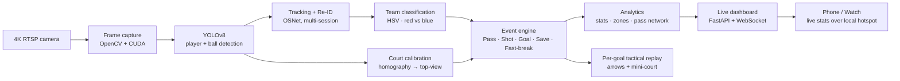

# Handball AI — Real-Time Tactical Analysis

> Pipeline متكامل لتحليل ماتشات كرة اليد من فيديو broadcast: تتبع اللاعبين والكرة، كشف الأحداث (Pass / Shot / Goal / Save / Fast Break)، توليد تقارير تكتيكية على طريقة Once Sport / Scoutz / Data Video 2007.

> **Portfolio showcase — proprietary.** This repository presents the *idea and engineering* of the system for demonstration only. See **[LICENSE](LICENSE)**: all rights reserved — no use, copying, or redistribution.

### How it works



### Highlights
- **100% offline**, real-time analysis from a 4K RTSP camera (CUDA / RTX).
- **YOLOv8** player + ball detection with multi-session **re-identification** (OSNet).
- Automatic **team classification** (HSV) and **court homography** for a true top-down view.
- **Event engine** — passes, shots, goals, saves, fast-breaks — with per-goal **tactical replays** (arrows + mini-court).
- Live **dashboard** (FastAPI + WebSocket) streaming stats to a phone / smartwatch over a local hotspot.

---

## جدول المحتويات
1. [نظرة عامة](#نظرة-عامة)
2. [الـ Pipeline](#الـ-pipeline)
3. [البنية والملفات](#البنية-والملفات)
4. [التثبيت والتشغيل](#التثبيت-والتشغيل)
5. [الـ CLI Flags](#الـ-cli-flags)
6. [الموديولات بالتفصيل](#الموديولات-بالتفصيل)
7. [Training: الموديل المُدرَّب على كرة اليد](#training-الموديل-المُدرَّب-على-كرة-اليد)
8. [مخرجات النظام](#مخرجات-النظام)
9. [رحلة المشاكل والحلول](#رحلة-المشاكل-والحلول)
10. [الحالة الحالية](#الحالة-الحالية)
11. [Future Work](#future-work)

---

## نظرة عامة

### الهدف
بناء نظام بمستوى احترافي (Once Sport / Hawk-Eye / Scoutz) يحلل ماتشات كرة اليد من فيديو broadcast ويُخرج:
- **Live HUD**: نتيجة الماتش، الفريق المسيطر، عدد التسديدات، Fast Breaks
- **Per-goal tactical replay** (PNG + MP4): freeze قبل كل جون مع أسهم تعرض المسار التكتيكي + Mini-court inset
- **Per-player Stats**: Goals, Shots, Eff%, Wing/9m/6m/7m zones
- **Match Analytics**: pass network, possession heatmap, pivot/jump-shot detection

### المرجع
مجلد `IDEA/` فيه screenshots من Once Sport و Data Video 2007 + sample PDF reports من Alahly vs Smoha (Adam Shot Report, Khaled Shot Report, Kaeam GK Save Report). دي الجودة المستهدفة.

### الأدوات الأساسية
| Component | Tech |
|---|---|
| Detection | YOLOv8s-pose (players) + YOLOv8n fine-tuned (ball) |
| Tracking | BoT-SORT (players) + Kalman Filter (ball) |
| ReID | Multi-session HSV + LAB anchor fingerprints |
| OCR | EasyOCR (jersey numbers) — async background worker |
| GUI | OpenCV native window + optional Streamlit dashboard |
| Inference | CUDA / TensorRT |

---

## الـ Pipeline

```
   ┌──────────────────┐
   │   Capture (RTSP/file)
   └──────┬───────────┘
          ▼
   ┌──────────────────┐
   │  Detector        │  YOLOv8-Pose (players, 17 keypoints)
   │  • Players       │  YOLOv8n / fine-tuned (ball)
   │  • Ball          │
   └──────┬───────────┘
          ▼
   ┌──────────────────┐
   │  Tracker         │  BoT-SORT player IDs
   │  • Player BoT-SORT│  Kalman ball filter (predict + gate + smooth)
   │  • Kalman ball   │  Anti-shoe / Anti-head / Hand-magnet
   │  • Phantom mode  │  Stationary-marker auto-blacklist
   └──────┬───────────┘
          ▼
   ┌──────────────────┐
   │  ReID Layer      │  PlayerReID merges lost IDs
   │  • PlayerReID    │  MultiSessionReID — persistent fingerprint gallery
   │  • MSR           │  pid → jersey number (cross-session)
   └──────┬───────────┘
          ▼
   ┌──────────────────┐
   │  OCR (async)     │  EasyOCR on player upper torso
   │                  │  Vote → lock once cumulative confidence ≥ 2.5
   └──────┬───────────┘
          ▼
   ┌──────────────────┐
   │  Rules Engine    │  Possession (debounced 6 frames)
   │                  │  Pass / Shot (with speed cap + cooldown)
   │                  │  Goal — three paths:
   │                  │   1. _resolve_shot  (post-shot trajectory)
   │                  │   2. _check_goal_smart (12% goal region + speed evidence)
   │                  │   3. _check_direct_goal (real ball inside dynamic goal box)
   │                  │  Fast Break (4s cooldown + ≥1 visible defender)
   └──────┬───────────┘
          ▼
   ┌──────────────────┐
   │  Goal Replay     │  Pre/post buffer + tactical overlay PNG
   │                  │  IDEA-style mini-court 2D inset
   │                  │  Auto-pause display 4.5s on goal
   └──────────────────┘
```

---

## البنية والملفات

```
Handball project/
├── src/                            # كل الـ source code
│   ├── pipeline.py                 # الـ entry point الأساسي
│   ├── capture.py                  # RTSP/file capture في thread منفصل
│   ├── detector.py                 # YOLOv8 dual-engine (pose + ball)
│   ├── tracker.py                  # BoT-SORT + Kalman ball + phantom logic
│   ├── ball_kalman.py              # Kalman Filter للكرة (gating + smoothing)
│   ├── player_reid.py              # دمج الـ IDs المفقودة عبر occlusions
│   ├── multi_session_reid.py       # gallery دائم بالـ HSV fingerprints
│   ├── jersey_ocr.py               # EasyOCR على أرقام القمصان (background thread)
│   ├── handball_rules.py           # Rules engine — Possession/Pass/Shot/Goal/...
│   ├── goal_replay.py              # tactical freeze + MP4 + 2D mini-court
│   ├── goal_post_detector.py       # Dynamic goal-frame detection (geometric)
│   ├── court_mask.py               # Color-agnostic court region mask (opt-in)
│   ├── court_detector.py           # IHF court keypoints + homography
│   ├── court_mapper.py             # Pixel→meter coordinate transforms
│   ├── static_marker_filter.py     # حجب العلامات الثابتة على الأرض
│   ├── motion_ball.py              # Frame-diff للكرات السريعة (opt-in)
│   ├── team_color.py               # Auto LAB+KMeans team color clustering
│   ├── state_manager.py            # حفظ الـ track IDs ↔ team mapping
│   ├── match_analyzer.py           # تجميع stats لكل لاعب وكل فريق
│   ├── report_generator.py         # PDF reports
│   ├── coach_agent.py              # AI coaching commentary (LLM-based)
│   ├── handball_coach.py           # Tactical pattern recognition
│   ├── pose_analyzer.py            # Skill detection (jump shot / pivot / block)
│   ├── technique_detector.py       # Per-player technique stats
│   ├── goalkeeper_analyzer.py      # GK save zone analytics
│   └── ...
│
├── training/                       # Custom-trained ball model pipeline
│   ├── auto_label.py               # generate labels من فيديوهاتك تلقائياً
│   ├── annotate_ball.py            # Manual annotation (click-based)
│   ├── train_ball.py               # Fine-tune yolov8n على الـ dataset
│   ├── dataset/                    # Generated train/val data
│   │   ├── images/{train,val}/
│   │   └── labels/{train,val}/
│   └── runs/ball_v2/weights/best.pt → handball_ball.pt (root)
│
├── handball_ball.pt                # الـ fine-tuned ball model (auto-loaded)
├── yolov8s-pose.pt                 # COCO pose model (players)
├── yolov8n.pt                      # COCO nano (fallback ball)
│
├── reports/<session_id>/goals/     # Goal replay outputs
│   ├── goal_001.png                # Tactical freeze + arrows + mini-court
│   ├── goal_001.mp4                # 5.5-sec replay clip
│   └── goal_001.json               # Trajectory + scorer metadata
│
├── data/
│   ├── multi_session_reid.json     # Persistent player fingerprints + numbers
│   ├── match_state.json            # Persistent state-manager DB
│   └── analytics/                  # Per-player heatmaps
│
├── logs/
│   └── analytics_snapshot.npz      # Periodic background-worker dump
│
├── config/
│   ├── camera.yaml                 # RTSP credentials + undistort params
│   ├── homography_matrix.npy       # (optional) court calibration
│   ├── teams.yaml                  # Team names/colors override
│   └── system.yaml                 # Tunables
│
├── dashboard/app.py                # Streamlit live dashboard
├── IDEA/                           # Reference: Once Sport screenshots + sample PDFs
├── *.bat                           # Run scripts
└── *.mp4                           # Test videos
```

---

## التثبيت والتشغيل

### المتطلبات
- Windows 10/11 + Python 3.12
- NVIDIA GPU (CUDA 12.x) — يشتغل CPU برضه لكن بطيء جداً
- ~6 GB GPU RAM

### Setup
```cmd
python -m venv .venv
.venv\Scripts\python.exe -m pip install -r requirements.txt
.venv\Scripts\python.exe -m pip install easyocr        # للـ jersey OCR
```

> **مهم**: `easyocr` بيجيب `opencv-python-headless` كـ dep ودي بتلغي الـ GUI.
> لو حصلت مشكلة `cv2.namedWindow not implemented`:
> ```cmd
> .venv\Scripts\python.exe -m pip uninstall opencv-python-headless -y
> .venv\Scripts\python.exe -m pip install --force-reinstall opencv-python
> ```

### تشغيل سريع — على فيديو ملف
```cmd
test_video.bat hand3.mp4
```
أو يدوياً:
```cmd
".venv\Scripts\python.exe" src\pipeline.py ^
    --source "hand3.mp4" ^
    --device cuda:0 ^
    --model "yolov8s-pose.pt" ^
    --imgsz 640 ^
    --conf 0.40 ^
    --ball-conf 0.05 ^
    --infer-every 2 ^
    --display-every 2 ^
    --scale 0.7 ^
    --debug
```

### تشغيل مع Streamlit Dashboard
```cmd
run_test_dashboard.bat
```
بيفتح pipeline.py + يطلق dashboard على `http://localhost:8501`.

### تشغيل live من كاميرا Hikvision
```cmd
run_live.bat
```
محتاج تظبط `config/camera.yaml` بـ IP + credentials.

### Hotkeys في نافذة "Handball AI"
| Key | Action |
|---|---|
| `Q` | Quit |
| `D` | Toggle debug overlay |
| `R` | Recalibrate team colors |
| `F` | Flip attacking sides |
| `A` / `B` | Manual goal Home/Away |
| `SPACE` | Dismiss tactical-freeze overlay early |

---

## الـ CLI Flags

```cmd
src\pipeline.py [OPTIONS]
```

| Flag | Default | الوصف |
|---|---|---|
| `--source PATH` | (interactive) | فيديو ملف أو RTSP URL |
| `--device DEVICE` | `cuda:0` | `cuda:0` / `cuda:1` / `cpu` |
| `--model PATH` | `yolov8s-pose.pt` | Pose model للاعبين |
| `--conf FLOAT` | `0.40` | Person detection threshold (large) |
| `--ball-conf FLOAT` | `0.02` | Ball detection threshold — يُرفع تلقائياً لـ 0.20 لو الموديل المُدرَّب موجود |
| `--imgsz INT` | `640` | YOLO input size |
| `--infer-every INT` | `2` | Run detection كل N frames (sceleton tracking في الباقي) |
| `--display-every INT` | `2` | Render UI كل N frames |
| `--scale FLOAT` | `1.0` | Display scale (0.7 = أصغر) |
| `--debug` | off | يعرض debug overlay (BALL/TRACKS/REID/blacklist) |
| `--no-static-marker` | off | يطفي static-marker filter (default: ON) |
| `--motion-ball` | off | يفعل motion-based ball detection (نويزي) |
| `--court-mask` | off | يفعل court-region mask filtering |
| `--no-ocr` | off | يطفي EasyOCR jersey numbers |
| `--no-analytics` | off | يطفي background analytics worker |

---

## الموديولات بالتفصيل

### `pipeline.py`
الـ entry point. بيدير الـ flow كامل:
1. Capture frame → 2. Detect → 3. Track → 4. ReID → 5. OCR → 6. Rules → 7. Display + Replay

### `detector.py`
Dual-engine YOLO:
- **Pose**: yolov8s-pose للاعبين (17 keypoints لكل لاعب)
- **Ball**: `handball_ball.pt` لو موجود (fine-tuned، median conf=0.72)، fallback `yolov8n.pt`
- Geometric filters: `area=[20, 9000]`, `aspect_max=4.0`
- لما الموديل المُدرَّب يُحمَّل، الـ ball_conf يُرفَع تلقائياً لـ 0.20 (لأن الموديل واثق على الكرات الحقيقية)

### `tracker.py`
الأهم في النظام. بيشتغل على 4 طبقات:

**1. Player tracking (BoT-SORT)**
- `track_high_thresh=0.15`, `new_track_thresh=0.20` (منخفضين عشان نلتقط لاعبين بعيدين)
- `_TrackerInput` adapter للـ ultralytics 8.4 API (مهم — كان يكسر الـ tracker قبله)

**2. Ball candidate scoring (simple = stable)**
درس من 6 محاولات: الـ scoring البسيط أحسن من الفلاتر المتراكمة.
- Hand-magnet `+0.9` لما الكرة قريبة من wrist
- Anti-shoe `-1.5` لما الكرة في أسفل bbox اللاعب
- Anti-head `-1.8` (top 18% of player bbox)
- Anti-body `-0.8` (داخل bbox بعيد عن wrists)
- Airway bonus `+0.5` (فوق shoulders)

**3. HARD head/face rejection (nose keypoint based)**
- أي ball candidate خلال 30px من nose/eye keypoint → **REJECTED تماماً**
- بصرف النظر عن confidence أو hand proximity
- ده اللي قتل أكبر مشكلة (head-as-ball false positives)

**4. Stationary-killer**
- لو نفس الـ candidate قعد ≤4 px من last_ball_pos لـ 4 frames متتالية → blacklist للنقطة
- البلاك ليست بتفضل 60 ثانية → الملصقة على الأرض ما تعدش
- بترسم دوائر حمرا "MARKER" في debug overlay

**5. Kalman ball filter**
موديول جديد ([ball_kalman.py](src/ball_kalman.py)):
- 6-state vector: position + velocity + acceleration
- Constant-acceleration physics
- **Mahalanobis gating (3.5σ)**: الـ detections اللي مش متسقة مع المسار **ترفض تلقائياً**
- Lock بعد 2 detections متسقة
- Output position = smoothed Kalman state (مش raw YOLO)

### `ball_kalman.py` (الحل الذكي)
الفلاتر القديمة كانت تشتغل في frame واحد. الـ Kalman يشتغل في الزمن:
1. **Predict**: مكان الكرة المتوقع
2. **Gate**: detections بعيدة عن المسار → reject (يقتل head FPs والملصقات)
3. **Update**: detection مقبولة → fuse مع التنبؤ
4. **Output**: smoothed position يقاوم jitter

| Tunable | Default | الوصف |
|---|---|---|
| `Q_POS / Q_VEL / Q_ACC` | 1 / 4 / 16 | Process noise |
| `R_BASE` | 4.0 | Measurement noise (high conf) |
| `R_AT_LOW_CONF` | 60.0 | Measurement noise (low conf) |
| `GATE_M` | 3.5 | Mahalanobis gate (99.7% ellipse) |
| `MAX_MISSED_FRAMES` | 25 | Reset filter بعد كده |

### `handball_rules.py`
Rules engine بـ debounce وcooldowns مدروسين:

| Event | Detection logic |
|---|---|
| **POSSESSION_CHANGE** | الـ closest player للكرة لازم يفضل نفسه لـ **6 frames متتالية** قبل ما الـ flip يحصل |
| **PASS** | Same team, different player, ball speed > 8 px/f |
| **SHOT** | speed > 18 px/f، possession set، moving toward attacking goal، speed cap 90 px/f، cooldown 1.5s |
| **GOAL** (3 paths) | 1. `_resolve_shot` post-shot trajectory<br>2. `_check_goal_smart` ball in 12% goal region + speed/shot evidence<br>3. `_check_direct_goal` real ball ≥4 frames inside dynamic_goal_box |
| **FAST_BREAK** | possession changed 0.4-3s ago، speed 14-80 px/f، ≥1 defender visible، cooldown 4s |
| **Phantom suppression** | لو phantom streak >2، الـ rules engine ميفجرش events |

### `goal_replay.py`
عند كل GOAL event، بيخرج 3 ملفات:
- **PNG**: freeze + arrows + 2D mini-court inset (Once Sport style)
- **MP4**: 4s pre + 1.5s post بـ overlays
- **JSON**: trajectory + scorer metadata

ميزات الـ overlay:
- Spotlight ring عند رجلين المسدد (team color)
- Yellow trajectory polyline + arrowhead
- Red dashed shooter run-up arrow
- GK ellipse highlight
- Mini-court 360×180 px في الـ corner: schematic court + player dots + zone label ("9m Centre")
- Auto-pause في cv2 window لـ 4.5 ثانية (SPACE = skip)

### `goal_post_detector.py`
Dynamic goal-frame detection بـ Canny edges + vertical morphology:
- يلاقي الـ vertical posts بـ aspect ratio ≥ 3.0
- يجمعها في pairs بفروق y-top متشابهة
- EMA smoothing عبر الـ frames
- يتكامل مع `_check_direct_goal` في rules engine

### `court_mask.py` (opt-in)
Color-agnostic court region detection:
- HSV S/V mask + largest connected component
- Auto-discover dominant hue من الـ frame (يدعم blue/yellow/green/red courts)
- Lower portion check (centroid في النصف السفلي)
- Visibility threshold 0.06 = "play frame"
- لو OFF (default) → ما فيش filtering للـ detections

### `multi_session_reid.py`
Persistent player gallery عبر sessions:
- HSV histogram fingerprint (576-d HS + 3-d LAB anchor)
- Best-of-12 gallery لكل لاعب (زوايا مختلفة)
- `MATCH_THRESHOLD = 0.68`، diversity gate 0.88
- يحفظ في `data/multi_session_reid.json`
- `rename(pid, name, number)` بيحفظ jersey number → bound to fingerprint

### `jersey_ocr.py`
EasyOCR على player crops:
- Background thread (non-blocking للـ pipeline)
- Pose-aware crop (shoulders + hips → upper torso)
- Voting cache: cumulative confidence ≥ 2.5 + margin ≥ 1.5 → lock
- **Unique-number constraint** per team (يمنع Clone Army)
- يربط الرقم بـ MSR pid → cross-session persistence

### `static_marker_filter.py`
Cell-based blacklist للـ ball candidates الثابتة:
- Cell size 10 px، hit_window 75 frames، threshold 0.70
- Player-aware: لو لاعب قريب من الـ cell ≥ 45% من الوقت، ما تتحجبش (kara بـ يد لاعب)
- Exclusion TTL 60s

### `motion_ball.py` (opt-in)
Frame-diff based ball detection للكرات السريعة:
- يحسب diff بين frame_n و frame_n-1
- يستبعد motion في bboxes اللاعبين
- يلاقي round moving blobs (10-1500 px²)
- Default OFF — بيولّد candidates نويزية في الـ scenes المزدحمة

### `match_analyzer.py`
بيجمع stats لكل لاعب وفريق من الـ rules events:
- Per-player: goals, shots, eff%, assists, saves
- Per-zone: wing_left/right, center_6m, center_9m, penalty_7m
- Per-team: goals, shots, eff%, fast breaks, saves, turnovers

### `report_generator.py`
PDF reports من ReportLab:
- Match Summary table
- Advanced Player Shooting Stats
- Individual Player Cards بـ zone breakdown
- على نمط ملفات `IDEA/Adam (2) - Alahly vs Smoha - Shot Report.pdf`

---

## Training: الموديل المُدرَّب على كرة اليد

YOLOv8 COCO اتدرب على white footballs / yellow tennis balls — مش handball. النتيجة: recall ~30% فقط على فيديوهاتك. الحل: fine-tune على عيناتك.

### Auto-labeling (مفيش تعليق يدوي)
```cmd
.venv\Scripts\python.exe training\auto_label.py hand3.mp4
.venv\Scripts\python.exe training\auto_label.py handball.mp4
```
السكربت بيستخدم الـ pipeline الحالي يستخرج detections، بعدين يرفض اللي:
- ثابتة عبر samples (markers)
- خارج temporal consistency (false positives)
- < min confidence

النتيجة: ~500-1000 sample نظيف لكل فيديو، ينحفظوا في `training/dataset/images+labels/train/`.

### Manual labeling (لو محتاج دقة أعلى)
```cmd
.venv\Scripts\python.exe training\annotate_ball.py hand3.mp4
```
GUI: left-click على الكرة، right-click "no ball"، N للـ next frame.

### Training
```cmd
.venv\Scripts\python.exe training\train_ball.py --epochs 60 --batch 16
```
- يقسم 90/10 train/val تلقائياً
- 60 epochs على GPU = ~10 دقائق
- النتيجة في `training/runs/ball_v2/weights/best.pt`

### تفعيل الموديل الجديد
```cmd
copy training\runs\ball_v2\weights\best.pt handball_ball.pt
```
الـ detector.py يلاقيه تلقائياً ويستخدمه (مع `ball_conf` مرفوع لـ 0.20).

### نتائج آخر training
| Metric | Value |
|---|---|
| Precision | 76% |
| Recall | 86% |
| mAP@50 | 84% |
| mAP@50-95 | 0.61 |
| Median conf على real balls | 0.72 |

---

## مخرجات النظام

### Live Display (cv2 window)
- HUD bar: Score / Period clock / Possession (with 0s timer)
- Sidebar: Shots / Fast Breaks per team + Events feed
- Player ellipses + jersey labels (`A#11`, `B#23`, ...)
- Yellow ball circle (cyan if real, orange if phantom)
- Debug bar: `BALL:real TRACKS:N REID:Kknown/Ssession LAST_SHOT LAST_GOAL`

### Goal Replay (per goal)
```
reports/<session_id>/goals/
├── goal_001.png        ← IDEA-style freeze
├── goal_001.mp4        ← 5.5s tactical replay
└── goal_001.json       ← {scorer, shot_fn, trajectory[], shooter_tid, raw_event}
```

### Persistent State
```
data/
├── multi_session_reid.json     # players + jersey numbers
└── match_state.json             # team mappings + scores
```

### Analytics
```
logs/analytics_snapshot.npz      # heatmaps + per-player skills/distance
data/analytics/<pid>.json        # per-player profile
data/analytics/<pid>_heatmap.npy
```

### PDF Match Report
```
reports/report_fulltime_<timestamp>.pdf
```

---

## رحلة المشاكل والحلول

كل مشكلة هنا لقيناها في تشغيل حقيقي وإيه اللي حلها. مهم نعرف ليه التصميم الحالي بالشكل ده.

### 1. Tracking كان بيرجع 0 players
- **العَرَض**: tracks = [] دايماً، الـ HUD مفيش events
- **السبب**: ultralytics 8.4 غيّر BoT-SORT API — بقت تستنى object فيه `.conf`/`.cls`/`.xyxy` بدل `np.ndarray`
- **+ السبب الثاني**: `new_track_thresh = 0.70` كان عالي جداً، لاعبين بعيدين بيجوا بـ conf 0.36-0.6 → كلهم بترفض
- **الحل**:
  - `_TrackerInput` adapter class يلف الـ ndarray ويعرض الـ properties
  - `new_track_thresh: 0.70 → 0.20`، `track_high_thresh: 0.25 → 0.15`
  - `fuse_score=True` + كل الـ defaults الناقصة في cfg

### 2. NameError: tracks في `_resolve_shot`
- **العَرَض**: pipeline يكراش لما حد يصوّب أول مرة
- **السبب**: `def _resolve_shot(self, ball_track, ...)` كان بيستخدم `tracks` من غير ما تكون argument
- **الحل**: ضفت `tracks` للـ signature + الـ call sites

### 3. "GK#1" Clone Army
- **العَرَض**: 4-8 لاعبين كلهم labeled "GK#1" / "B#1"
- **السبب الجذري**: HSV color histogram بيـcollapse لما الملعب أصفر + الجرسي أصفر (Sweden case). كل اللاعبين بصمتهم اللونية متشابهة → MSR يخصص نفس الـ pid لكلهم
- **+ السبب الثاني**: BoT-SORT tracker بيخسر IDs مع occlusions، tracks جديدة تتولد، OCR بيقفل نفس الرقم على tracks مختلفة
- **الحل**:
  1. Fingerprint جديد: HS 2D histogram (576-d) + LAB anchor (3-d) — أكتر استقراراً ضد bleeding
  2. **Unique-number constraint** في `jersey_ocr.py`: نفس الرقم مش ممكن يتقفل على track-IDs مختلفة لنفس الفريق
  3. **Bind OCR number to MSR pid**: لما tracker يخسر ID ويرجع، MSR يلاقي اللاعب بالـ fingerprint → يرجع الرقم تلقائياً

### 4. Players outside court being tracked (crowd, bench, photographers)
- **العَرَض**: ellipses على الجماهير في المدرجات + الـ bench + المصورين
- **السبب**: YOLO ما عندوش concept للملعب
- **الحل**: `court_mask.py` — color-agnostic court region. اللاعبين اللي رجليهم برة الـ mask بترفض. **opt-in via `--court-mask`** عشان مش كل الفيديوهات تحتاجها

### 5. Pre-match lineup graphic detected as players
- **العَرَض**: portraits الستاتيكية في الـ lineup screen بياخدوا IDs
- **السبب**: YOLO يشوف human shapes، مفيش awareness للـ broadcast graphics
- **الحل**: `is_play_frame()` في court_mask — لو visibility < 6%، nothing tracked

### 6. Phantom ball flying around the court
- **العَرَض**: Orange "ghost" ball طايرة في مكان عشوائي خارج الملعب
- **السبب**: Mode-2 phantom logic كان يـextrapolate linearly كل ما الكرة تختفي
- **الحل**: شيلنا Mode-2 entirely. Mode-1 (hand-anchor عند wrist) بس
- **ورجعنا للنسخة القديمة المستقرة** بعد ما ضافنا continuity bonuses كانوا بيلصقوا الكرة بمكان غلط

### 7. Floor sticker / paint detected as ball
- **العَرَض**: yellow ellipse على الـ 6m line painted mark
- **السبب**: YOLO COCO ما يفرقش بين كرة صفرا ودائرة صفرا على الأرض
- **الحل** (بطبقات):
  1. `static_marker_filter.py` — cell-based blacklist لما candidate يفضل في نفس الـ cell ≥ 70% من 75 frame
  2. **Stationary-killer في tracker.py** — لو same position ±4px لـ 4 frames → blacklist (radius 22px) لـ 60s
  3. **Auto-label re-trained**: استبعدنا 4 marker spots من الـ training data → الموديل ما اتعلمش إنها كرة

### 8. Player's head detected as ball
- **العَرَض**: yellow circle على رأس لاعب، Goal مش بيتعد لما الكرة تدخل الشبك
- **السبب**: الموديل المُدرَّب نفسه كان متلوّث (auto-labeler صنّف رؤوس ك balls). + Anti-head penalty كان gated على not-in-hand فما يـfire-ش لما wrist قريب
- **الحل**:
  1. **HARD nose-reject في tracker.py**: candidate خلال 30px من nose/eye keypoint → REJECTED تماماً (مش penalty)
  2. **Auto-label improvements**: stationary rejection + min movement threshold
  3. **ball_conf auto-bump لـ 0.20** مع الموديل المُدرَّب — يكنس weak FPs

### 9. Goal not counted even when ball clearly enters net
- **العَرَض**: الكرة في الشبك واضحة، الـ score 0-0
- **السبب**: الـ rule كان `bx >= fw - 30` (آخر 30 px فقط)، والـ goal_box detection بيفشل في كاميرات معينة
- **الحل** (3 paths متوازية):
  1. `_resolve_shot` (الأصلي): post-shot trajectory crossing
  2. `_check_goal_smart` (ported من النسخة القديمة): static 12% goal region (153px) + middle 50% vertical + speed/shot evidence
  3. `_check_direct_goal`: real ball detected inside dynamic_goal_box ≥4 frames + conf ≥ 0.25

### 10. Ridiculous stat inflation (Away: 32 shots, 105 fast breaks)
- **العَرَض**: stats غير معقولة بعد دقيقة لعب
- **السبب**: phantom ball jitter بين positions كان بيـtrigger:
  - POSSESSION_CHANGE كل frame (الـ closest player يتغير)
  - SHOT speed = 267 px/f (phantom teleport)
  - FAST_BREAK كل frame (الـ recent_change condition true دايماً)
- **الحل**:
  - POSSESSION debounce: 6 frames متتالية لنفس الـ team قبل الـ flip
  - SHOT speed cap: > 90 px/f → reject (phantom)
  - SHOT global cooldown: 1.5s بين أي shotain
  - FAST_BREAK cooldown: 4s + ≥1 defender visible
  - Phantom suppression: لو phantom streak > 2 frames، الـ rules engine يلغي pending shots ويوقف emit events

### 11. Camera angle changes break everything
- **العَرَض**: لما الكاميرا تتغير (wide → close-up → behind net)، الجون disappear، tracking يضيع
- **السبب**: dynamic_goal_box بيتأثر بالـ angle، court_mask بيـcalibrate غلط
- **الحل**:
  - `goal_post_detector.py` بـ EMA smoothing عبر الـ frames
  - `court_mask.py` colour-agnostic + auto-recalibration كل 4 frames
  - `_check_goal_smart` يستخدم static regions كـ fallback عند فشل dynamic

### 12. FPS dropped from 30 → 5 with all features
- **العَرَض**: video stuttering, cv2 lag
- **السبب**: 6 filters متتالية كلها يشتغلوا full-frame كل infer
- **الحل**:
  - `infer-every 1 → 2`
  - ROI ball detection (480px window حول last_ball_pos)
  - Velocity-based interpolation للـ skipped frames
  - `goal_replay.push_frame` على infer frames فقط (مش كل frame)
  - `goal_replay.downscale = 0.5` (4× memory savings)
  - OCR في background thread (non-blocking)

### 13. EasyOCR install broke OpenCV GUI
- **العَرَض**: `cv2.error: namedWindow not implemented`
- **السبب**: `easyocr` يجيب `opencv-python-headless` كـ dep، يلغي الـ GUI
- **الحل**: شيل headless + force-reinstall opencv-python (موثَّق في setup section)

### 14. Ball-tracking كان بيـover-correct (Continuity bonuses)
- **العَرَض**: الكرة تلصق بمكان قديم، تتأخر عن الحركة الحقيقية
- **السبب**: ضافنا `+0.50 bonus` للـ candidates close to last_ball_pos → النظام بقي **يفضل** detections في نفس المكان
- **الحل**: شيلنا الـ continuity bonuses تماماً. الـ scoring البسيط (penalty واحد للقفزات الكبيرة + hand magnet) أحسن

### 15. Anti-head penalty كان يرفض الكرة عند الـ release
- **العَرَض**: الكرة في إيد اللاعب فوق راسه (release moment) → النظام يخسرها
- **السبب**: anti-head penalty كان gated على `not in_hand`. اللاعب يطلق shot عالي → الكرة فوق راسه + قريبة من wrist → in_hand=True → penalty يتلغي → score يرتفع → كله تمام؟ لا، عشان `is_head` كان بيـfire لو الكرة جوا الـ bbox الأعلى، حتى لو قريبة من wrist
- **الحل**: nose-reject بالـ keypoint بدلاً من bbox-region penalty. الـ bbox-based head check بقي gated على `not in_hand`

### 16. Ultimate fix: Kalman trajectory tracking
- **التشخيص النهائي**: كل الفلاتر اللي ضافناها كانت تعمل قرار في **frame واحد**. الكرة الحقيقية والـ false positives ممكن يبقوا متطابقين في الـ frame الواحد. الفرق بيظهر في **الزمن**: الكرة بتتحرك بسرعة وتسارع متناسقين، الرأس/الملصقة لأ
- **الحل**: `ball_kalman.py` — Kalman Filter بـ Mahalanobis gating
- **النتيجة**: detections بعيدة عن المسار المتوقع ترفض **تلقائياً**، بصرف النظر عن أي شيء آخر. ده اللي بيستخدمه أي نظام احترافي (Hawk-Eye, TrackMan, Opta)

---

## الحالة الحالية

### بيشتغل صح
- Player tracking (BoT-SORT + ReID + persistent IDs)
- Ball detection (fine-tuned model، median conf 0.72)
- Ball Kalman tracking (gating + smoothing)
- Goal detection (3 paths)
- Goal replay (PNG + MP4 + JSON + 2D mini-court)
- Auto-pause tactical freeze (4.5s + SPACE skip)
- Static marker blacklist (visible in debug)
- Per-team possession + shots
- OCR jersey numbers (async)
- Multi-session player gallery

### يشتغل بقيود
- **Court mask**: يفشل في wide camera angles (visibility < 6%)
- **Goal post detector**: ineffective خلف الـ net angles
- **OCR**: لاعبين بعيدين أو محبوسة أرقامهم → no lock
- **Ball detection على فيديوهات جديدة**: محتاج auto_label + train cycle لكل ماتش جديد
- **Court calibration**: لازم homography_matrix.npy موجود للـ meter accuracy

### مش شغّال (بعد)
- Real-time team tactic classification (zone defense, 6-0, 5+1) — جزء من handball_coach.py لكن مش accurate
- Foul / 1v1 detection
- Penalty (7m) shot detection بدقة
- Manual annotation tool للـ training (موجود لكن needs UX work)

---

## Future Work

### Priority 1 (high impact)
- **Custom handball ball model**: re-train على dataset أكبر (5000+ samples) من ماتشات متعددة
- **Goal-mouth zone classification**: 3×3 grid على الـ goal frame → per-GK save analytics
- **Shot-type classification**: Wing / 6m / 9m / 7m / Fast Break / Long Distance per IDEA-style report
- **Per-player Shot Report PDF**: court diagram with shot dots + arrows (مطابق لـ Adam Shot Report.pdf)

### Priority 2
- **Pass network visualisation**: graph من passes بين اللاعبين
- **Tactical pattern recognition**: cross-wing, double pivot, 1v1
- **3D pose-based jump-shot detection**: airborne moments + release angle
- **Video-aware OCR**: temporal smoothing على الـ readings

### Priority 3
- **TrackNet integration**: architecture مخصصة للكرات الصغيرة السريعة (3-frame consensus)
- **Multi-camera fusion**: لو متاح 2+ كاميرات
- **Live RTSP streaming**: زمن استجابة < 200ms
- **Web dashboard**: استبدال الـ cv2 window بـ React/WebGL UI

---

## المراجع

- **IDEA/**: screenshots من Once Sport، Data Video 2007، Scoutz + sample PDFs
- **YOLOv8**: ultralytics docs
- **BoT-SORT**: arXiv:2206.14651
- **EasyOCR**: github.com/JaidedAI/EasyOCR
- **Kalman Filter**: Welch & Bishop, "An Introduction to the Kalman Filter"

## License
Internal project — لا توزيع.

## المساهمون
- Omar Essam Salah — owner / vision / engineering
